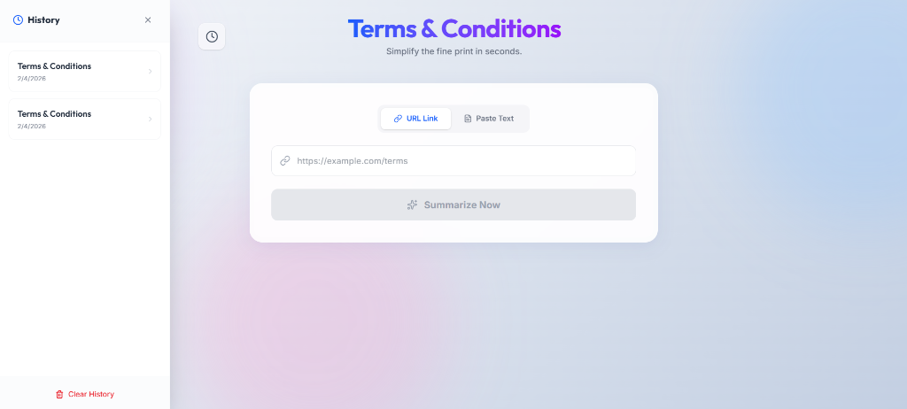

# Terms & Conditions Summarizer

**Terms & Conditions Summarizer** is an AI-powered web application designed to help users quickly understand complex legal agreements. By leveraging **LLMs (Groq/Llama)**, it transforms lengthy T&Cs into concise summaries, key risk points, and detailed breakdowns.



## 🚀 Features

-   **AI-Powered Summarization**: Instantly generates "At a Glance" summaries and detailed breakdowns.
-   **Risk Analysis**: Automatically categorizes key points into **High**, **Medium**, and **Low** risk levels.
-   **Glassmorphism UI**: A premium, modern interface featuring smooth animations and a responsive design.
-   **Multiple Input Methods**: Support for both URL inputs and direct text pasting.
-   **PDF Export**: Download summaries as professional PDF reports.
-   **Local History**: Automatically saves your recent summaries for quick access.
-   **Copy & Share**: One-click copy functionality for easy sharing.

## 🛠️ Tech Stack

### Frontend
-   **React** (Vite)
-   **Tailwind CSS** (Styling)
-   **Framer Motion** (Animations)
-   **Lucide React** (Icons)
-   **jsPDF** (PDF Generation)

### Backend
-   **Python**
-   **FastAPI**
-   **Groq API** (Llama 3 Models)
-   **BeautifulSoup4** (Web Scraping - *implied capability*)

## 📦 Installation & Setup

### Prerequisites
-   Node.js & npm
-   Python 3.8+
-   Groq API Key (Get one at [console.groq.com](https://console.groq.com))

### 1. Clone the Repository
```bash
git clone https://github.com/PravinElango/Terms-and-Conditions-Summarizer.git
cd Terms-and-Conditions-Summarizer
```

### 2. Backend Setup
Navigate to the backend directory and install dependencies.

```bash
cd backend
# Create a virtual environment (optional but recommended)
python -m venv venv
# Windows
venv\Scripts\activate
# Mac/Linux
source venv/bin/activate

# Install requirements
pip install -r requirements.txt
```

**Environment Configuration:**
Create a `.env` file in the `backend` directory and add your Groq API key:
```env
GROQ_API_KEY=your_groq_api_key_here
```

**Run the Backend:**
```bash
uvicorn main:app --reload
# Or python main.py if configured
```
The API will run at `http://localhost:8000`.

### 3. Frontend Setup
Navigate to the frontend directory and install dependencies.

```bash
cd ../frontend
npm install
```

**Run the Frontend:**
```bash
npm run dev
```
The application will open at `http://localhost:5173`.

## 📝 Usage

1.  Open the web app in your browser.
2.  Paste a URL to a Terms & Conditions page OR paste the raw text directly.
3.  Click **"Summarize Now"**.
4.  View the **At a Glance** summary, **Key Points**, and **Risk Analysis**.
5.  Use the **Download PDF** button to save the report.

## 🤝 Contributing

Contributions are welcome! Please feel free to submit a Pull Request.

## 📄 License

This project is licensed under the MIT License.
